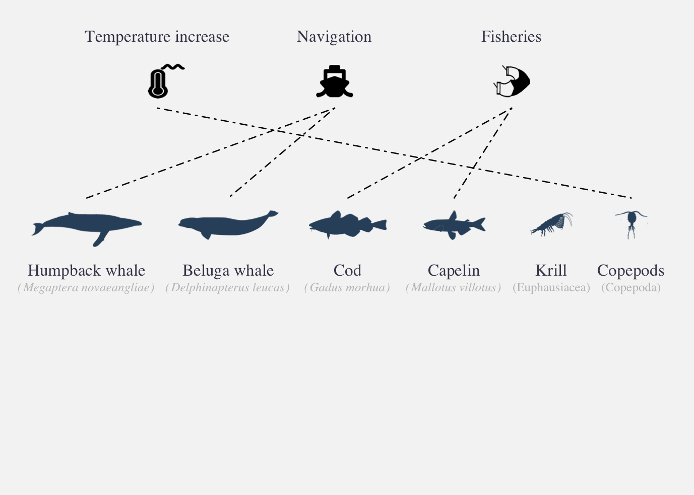
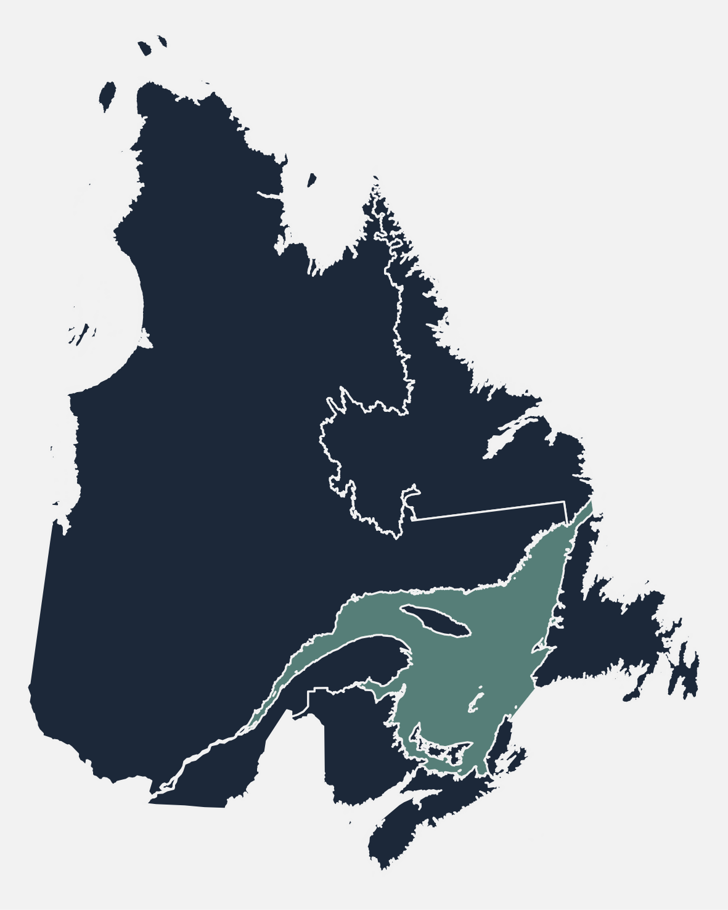
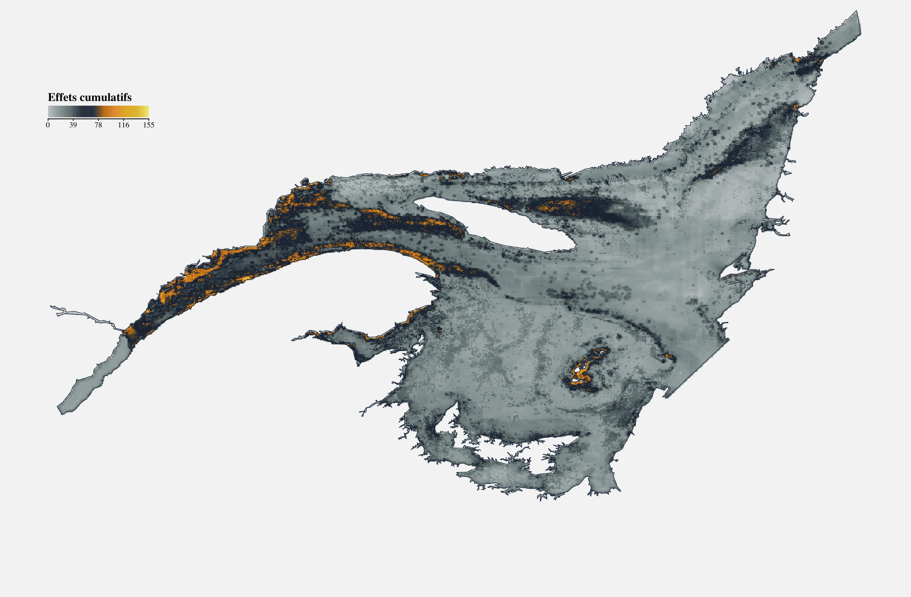
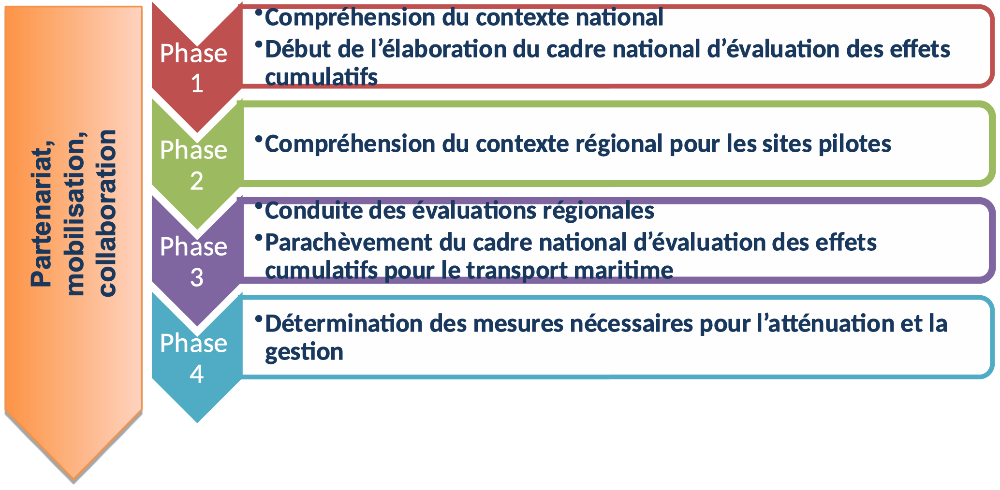
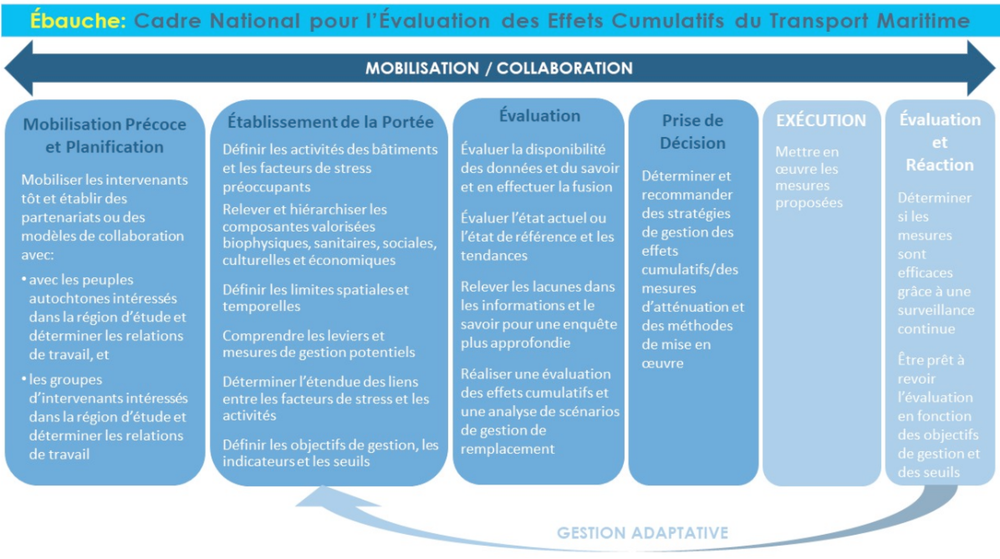
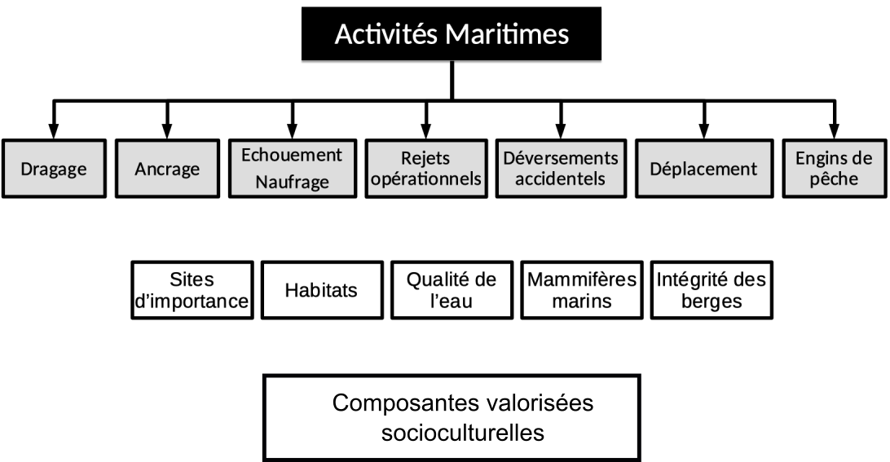
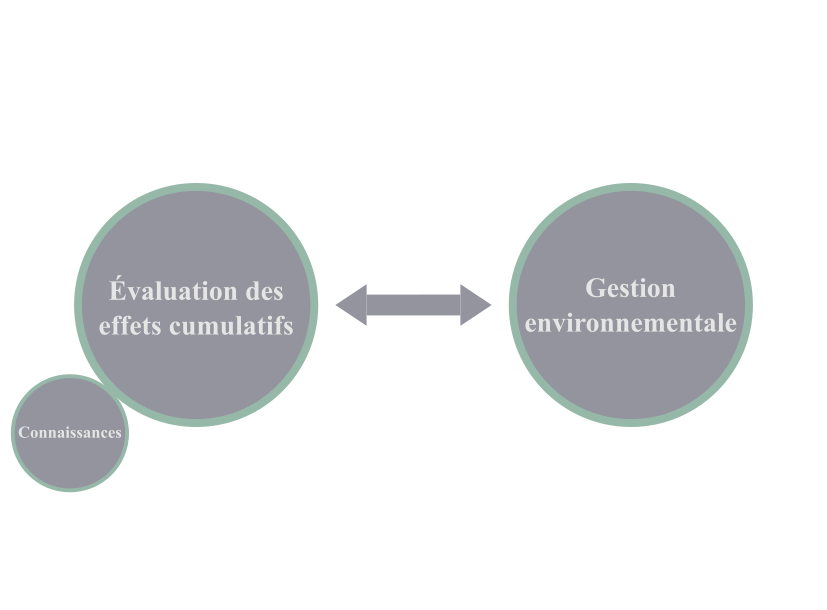
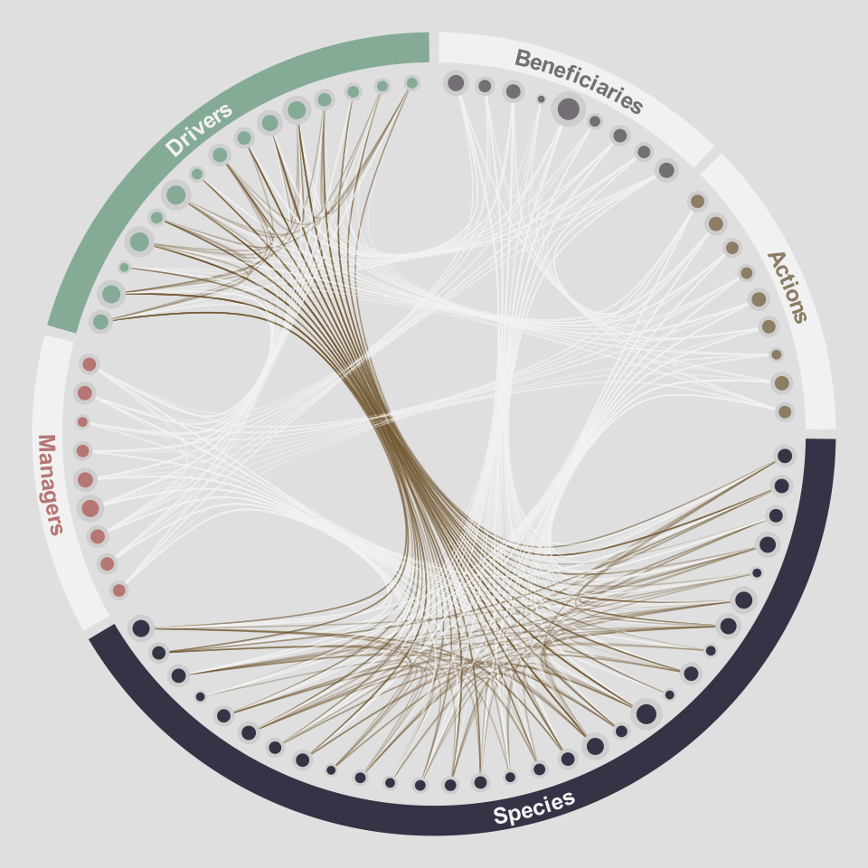
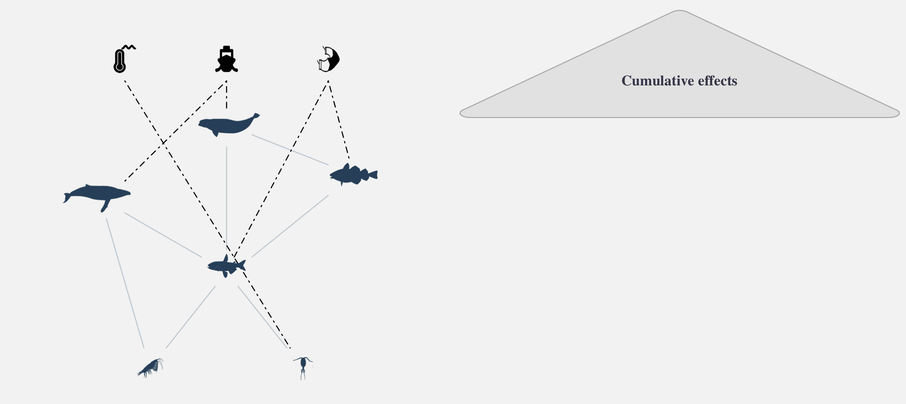

```{r setup, include=FALSE}
htmltools::tagList(rmarkdown::html_dependency_font_awesome())
```

class: title-slide, middle


# L'évaluation des effets cumulatifs dans un contexte de gestion écosystémique


.pull-left[
<center></img></center>
]

.pull-right[
<center></img></center>
]


### David Beauchesne

<span class="br2"></span>

<center>
</img>
</center>

<span class="br2"></span>

#### Congrès de l'Association québécoise pour l'évaluation d'impacts (AQÉI)
#### Impacts et effets cumulatifs : comment réponse aujourd'hui à ces impératifs?

<span class="br2"></span>

#### 2021-05-26


<!-- =~-~=~-~=~-~=~-~=~-~=~-~=~-~=~-~=~-~=~-~=~-~=~-~=~-~=~-~=~-~=~-~=~-~= -->
<!-- =~-~=~-~=~-~=~-~=~-~=~-~=~-~=~-~=~-~=~-~=~-~=~-~=~-~=~-~=~-~=~-~=~-~= -->
<!-- =~-~=~-~=~-~=~-~=~-~=~-~=~-~=~-~=~-~=~-~=~-~=~-~=~-~=~-~=~-~=~-~=~-~= -->
<!-- Évaluation des effets cumulatifs -->
<!-- =~-~=~-~=~-~=~-~=~-~=~-~=~-~=~-~=~-~=~-~=~-~=~-~=~-~=~-~=~-~=~-~=~-~= -->
<!-- =~-~=~-~=~-~=~-~=~-~=~-~=~-~=~-~=~-~=~-~=~-~=~-~=~-~=~-~=~-~=~-~=~-~= -->
<!-- =~-~=~-~=~-~=~-~=~-~=~-~=~-~=~-~=~-~=~-~=~-~=~-~=~-~=~-~=~-~=~-~=~-~= -->
---

class: inverse, center, middle

# Saint-Laurent - Saguenay

<html><div style='float:left'></div><hr color='#ffdd55' style="margin-top:-30px" size=1px width=720px></html>

<h2 style="color:#ffdd55;"><b>Évaluation des effets cumulatifs</b></h2>
<h2>Système du Saint-Laurent</h2>
<h2>Projet pilote activités maritimes</h2>
<h2>Gestion des connaissances</h2>


---

# Évaluation des effets cumulatifs

.references[
Loi canadienne sur l'évaluation environnementale (1992)
]

**Évaluation d'impact** : *Évaluation des effets d’un projet désigné effectuée conformément à la Loi sur l’évaluation d’impact (Canada).‍ Ou Évaluation de tout projet encadré par la procédure d’évaluation et d’examen des impacts sur l’environnement prévue en vertu de la Loi sur la qualité de l’environnement (Québec).‍*

--

**Effets cumulatifs** : *[...] les effets cumulatifs que [la] réalisation [d’un projet], combinée à l’existence d’autres ouvrages ou à la réalisation d’autres projets ou activités, est susceptible de causer à l’environnement*.

**Évaluation des effets cumulatifs** : *procédure systématique qui vise à identifier, à analyser et à évaluer les effets cumulatifs.*

--

**Pourquoi** : *Parce que les seuls effets qui comptent sont la somme totale des effets (effets cumulatifs), et non les effets de chaque projet individuel.*
- Bill Ross


---

# Évaluation des effets cumulatifs

<center></img></center>

.references[
Halpern et al. 2008; Halpern et al. 2015
]


---

# Évaluation des effets cumulatifs


<center></img></center>


.references[
Halpern et al. 2008; Halpern et al. 2015
]

---

# Évaluation des effets cumulatifs

<br/><br/>

<center></img></center>

.references[
Halpern et al. 2008; Halpern et al. 2015
]

---

# Évaluation des effets cumulatifs

<center></img></center>

.references[
Halpern et al. 2008; Halpern et al. 2015
]

---

# Évaluation des effets cumulatifs

<center></img></center>

.references[
Halpern et al. 2008; Halpern et al. 2015
]


---

# Évaluation des effets cumulatifs

<center></img></center>

.references[
Halpern et al. 2008; Halpern et al. 2015
]

---


# Évaluation des effets cumulatifs

<center></img></center>

.references[
Halpern et al. 2008; Halpern et al. 2015
]

---
# Évaluation des effets cumulatifs

<center></img></center>

???

- Considère toutefois que les stresseurs et les espèces sont indépendantes
- Plusieurs auteurs considèrent qu'il est irréaliste de considérer intégrer les interactions écologiques au sein d'évaluations environnementales dû à leur complexité
- Dans le cadre de ma thèse, je me suis efforcé à démontrer l'inverse en explorant l'importance de considérer les interactions et en développant une approche pour considérer explicitement les interactions et ainsi faire une évaluation des effets cumulatifs qui prend en considération les effets directs et indirects des stresseurs environnementaux.

---

# Évaluation des effets cumulatifs

.pull-left2[
## Interactions écologiques

**Effets indirects**

- Loutre
- Oursins
- Laminaires
]

.pull-right2[
<center></img></center>
]

.references[
Estes et Palmisano 1974; Paine 1980; Abrams 1992;  Estes et al. 2011
]

---

# Évaluation des effets cumulatifs

.pull-left2[
## Interactions écologiques

**Effets indirects**

- Loutre
- Oursins
- Laminaires

## Importance

- Peuvent être aussi importants que les effets directs
]

.pull-right2[
<center></img></center>
]

.references[
Wootton 1993, 2002; Menge 1995; Yodzis 2000
]

---

# Évaluation des effets cumulatifs

.pull-left2[
## Interactions écologiques

**Effets indirects**

- Loutre
- Oursins
- Laminaires

## Importance

- Peuvent être aussi importants que les effets directs

## Propagation des effets

- Structure des réseaux
  - Nombre d’interactions
  - Configuration
  - Intensité
]

.pull-right2[
<center></img></center>
]

.references[
Wootton 2002; Bascompte 2009; Montoya et al. 2009; O’Gorman et Emmerson 2009; O’Gorman et al. 2012
]

---

# Évaluation des effets cumulatifs

.pull-left2[
## Interactions écologiques

**Effets indirects**

- Loutre
- Oursins
- Laminaires

## Importance

- Peuvent être aussi importants que les effets directs

## Propagation des effets

- Structure des réseaux
  - Nombre d’interactions
  - Configuration
  - Intensité
]

.pull-right2[
<center></img></center>
]

.references[
Wootton 2002; Bascompte 2009; Montoya et al. 2009; O’Gorman et Emmerson 2009; O’Gorman et al. 2012
]


<!-- =~-~=~-~=~-~=~-~=~-~=~-~=~-~=~-~=~-~=~-~=~-~=~-~=~-~=~-~=~-~=~-~=~-~= -->
<!-- =~-~=~-~=~-~=~-~=~-~=~-~=~-~=~-~=~-~=~-~=~-~=~-~=~-~=~-~=~-~=~-~=~-~= -->
<!-- =~-~=~-~=~-~=~-~=~-~=~-~=~-~=~-~=~-~=~-~=~-~=~-~=~-~=~-~=~-~=~-~=~-~= -->
<!-- Case study: EGSL -->
<!-- =~-~=~-~=~-~=~-~=~-~=~-~=~-~=~-~=~-~=~-~=~-~=~-~=~-~=~-~=~-~=~-~=~-~= -->
<!-- =~-~=~-~=~-~=~-~=~-~=~-~=~-~=~-~=~-~=~-~=~-~=~-~=~-~=~-~=~-~=~-~=~-~= -->
<!-- =~-~=~-~=~-~=~-~=~-~=~-~=~-~=~-~=~-~=~-~=~-~=~-~=~-~=~-~=~-~=~-~=~-~= -->
---

class: inverse, center, middle

# Saint-Laurent - Saguenay

<html><div style='float:left'></div><hr color='#ffdd55' style="margin-top:-30px" size=1px width=720px></html>

<h2>Évaluation des effets cumulatifs</h2>
<h2 style="color:#ffdd55;"><b>Système du Saint-Laurent</b></h2>
<h2>Projet pilote activités maritimes</h2>
<h2>Gestion des connaissances</h2>


---

# Système du Saint-Laurent <!--St. Lawrence System-->

.pull-left2[
- Estuaire du Saint-Laurent

- Golfe du Saint-Laurent
]

.pull-right2[
<center></img></center>
]


---


# Système du Saint-Laurent <!--St. Lawrence System-->

## Stresseurs


.pull-left[
- Climat (6)
- Terrestre (5)
- Pêcheries (5)
- Navigation (2)
]

.pull-right[
<center></img></center>
]

.references[
.font90[Halpern et al. 2015; DFO 2016; Statistics Canada 2017; Galbraith et al. 2018; Blais et al. 2019; Earth observation group 2019; Starr et Chassé 2019]
]

---

# Système du Saint-Laurent <!--St. Lawrence System-->

## Composantes valorisées

.pull-left2[
- Poissons et invertébrés (169)
- Mammifères marins (24)
- Interactions
]

.pull-right2[
<center></img></center>
]

.references[
.font90[Dutil et al. 2011, 2012; DFO 2016; Assis et al. 2018; Bourdages et al. 2018; Galbraith et al. 2018; Blais et al. 2019; Starr et Chassé 2019]
]

---

# Évaluation des effets cumulatifs

## Distribution spatiale

<span class="br2"></span>

<center></img></center>


---

# Évaluation des effets cumulatifs

## Séquences d'effets

.pull-left2[
- Liens entre stresseurs et espèces

- Caractérisation du risque associé à chaque stresseur et pour chaque espèce
]

.pull-right2[
<center></img></center>
]


---

# Évaluation des effets cumulatifs

## Effets directs et indirects

.pull-left2[

]

.pull-right2[
<center></img></center>
]

---

# Évaluation des effets cumulatifs

## Effets directs et indirects

.pull-left2[
*Effets directs :*

Invertébrés : Tous les stresseurs

- Espèces sessiles
- Alimentation
- Composition corporelle
- Plus sensibles à leur environnement physico-chimique

Vertébrés : Navigation et Pêche

- Espèces mobiles
- Minimiser exposition aux stresseurs

]

.pull-right2[
<center></img></center>
]

.references[
Kroeker et al. 2010, 2013; Sydeman et al. 2015; Stier et al. 2016
]

---

# Évaluation des effets cumulatifs

## Effets directs et indirects

.pull-left2[
*Effets indirects :*

Invertébrés : Tous les stresseurs

- Moindre intensité relative
- Ressource / méso-prédateurs

Vertébrés : Tous les stresseurs

- Intensité des effets indirects supérieure
- Espèces de plus haut niveau trophique
- Plus sensibles aux effets indirects

]

.pull-right2[
<center></img></center>
]

.references[
Kroeker et al. 2010, 2013; Sydeman et al. 2015; Stier et al. 2016
]


<!-- =~-~=~-~=~-~=~-~=~-~=~-~=~-~=~-~=~-~=~-~=~-~=~-~=~-~=~-~=~-~=~-~=~-~= -->
<!-- =~-~=~-~=~-~=~-~=~-~=~-~=~-~=~-~=~-~=~-~=~-~=~-~=~-~=~-~=~-~=~-~=~-~= -->
<!-- =~-~=~-~=~-~=~-~=~-~=~-~=~-~=~-~=~-~=~-~=~-~=~-~=~-~=~-~=~-~=~-~=~-~= -->
<!-- Gestion des connaissances -->
<!-- =~-~=~-~=~-~=~-~=~-~=~-~=~-~=~-~=~-~=~-~=~-~=~-~=~-~=~-~=~-~=~-~=~-~= -->
<!-- =~-~=~-~=~-~=~-~=~-~=~-~=~-~=~-~=~-~=~-~=~-~=~-~=~-~=~-~=~-~=~-~=~-~= -->
<!-- =~-~=~-~=~-~=~-~=~-~=~-~=~-~=~-~=~-~=~-~=~-~=~-~=~-~=~-~=~-~=~-~=~-~= -->
---

class: inverse, center, middle

# Saint-Laurent - Saguenay

<html><div style='float:left'></div><hr color='#ffdd55' style="margin-top:-30px" size=1px width=720px></html>

<h2>Évaluation des effets cumulatifs</h2>
<h2>Système du Saint-Laurent</h2>
<h2 style="color:#ffdd55;"><b>Projet pilote activités maritimes</b></h2>
<h2>Gestion des connaissances</h2>


---

# Projet pilote activités maritimes

## Objectifs

- Développement d’un cadre et d’une méthodologie d’évaluation des effets cumulatifs
- Collecte de données (environnementales, socioculturelles, usages traditionnels et navigation) pour l’analyse
- Évaluations régionales des effets cumulatifs
- Recommandation de stratégies d’atténuation des effets cumulatifs


<center></img></center>


---

# Projet pilote activités maritimes

## Cadre national

<br/>

<center></img></center>


---

# Projet pilote activités maritimes

## Évaluations régionales

<br/>

.pull-left2[
.font90[
- Biorégion du plateau Nord (C.-B.)
- Côte Sud (C.-B.)
- **Fleuve Saint-Laurent (QC)**
- Baie Cambridge (Nunavut)
- Baie de Fundy (N.-É. et N.-B.)
- Baie Placentia (T.-N.)
]
]

.pull-right2[
<center></img></center>
]

---

# Projet pilote activités maritimes

## Fleuve Saint-Laurent (QC)

.pull-left2[
.font90[
[Interactive map](https://effetscumulatifsnavigation.github.io/ZoneEtude/)

**Collaboration / mobilisation :**

- Gouvernement du Canada
- Gouvernement du Québec
- Premières Nations
  - Abénakis
  - Hurons-Wendat
  - Malécites
  - Mohawks
  - Innus
- Intervenants locaux
- Organisations non-gouvernementales
]
]

.pull-right2[
<center></img></center>
]

<br/>

.footer[
<center></img></center>
]

---

# Projet pilote activités maritimes

## Fleuve Saint-Laurent (QC)

.pull-left2[
.font90[
**Collaboration / mobilisation :**
]
]

<center></img></center>

.footer[
<center></img></center>
]


<!-- =~-~=~-~=~-~=~-~=~-~=~-~=~-~=~-~=~-~=~-~=~-~=~-~=~-~=~-~=~-~=~-~=~-~= -->
<!-- =~-~=~-~=~-~=~-~=~-~=~-~=~-~=~-~=~-~=~-~=~-~=~-~=~-~=~-~=~-~=~-~=~-~= -->
<!-- =~-~=~-~=~-~=~-~=~-~=~-~=~-~=~-~=~-~=~-~=~-~=~-~=~-~=~-~=~-~=~-~=~-~= -->
<!-- Gestion des connaissances -->
<!-- =~-~=~-~=~-~=~-~=~-~=~-~=~-~=~-~=~-~=~-~=~-~=~-~=~-~=~-~=~-~=~-~=~-~= -->
<!-- =~-~=~-~=~-~=~-~=~-~=~-~=~-~=~-~=~-~=~-~=~-~=~-~=~-~=~-~=~-~=~-~=~-~= -->
<!-- =~-~=~-~=~-~=~-~=~-~=~-~=~-~=~-~=~-~=~-~=~-~=~-~=~-~=~-~=~-~=~-~=~-~= -->
---

class: inverse, center, middle

# Saint-Laurent - Saguenay

<html><div style='float:left'></div><hr color='#ffdd55' style="margin-top:-30px" size=1px width=720px></html>

<h2>Évaluation des effets cumulatifs</h2>
<h2>Système du Saint-Laurent</h2>
<h2>Projet pilote activités maritimes</h2>
<h2 style="color:#ffdd55;"><b>Gestion des connaissances</b></h2>


---

# Gestion des connaissances

## Gestion - Évaluation - Connaissances

<span class="br2"></span>

.pull-right2[
<center></img></center>
]


---

# Gestion des connaissances

## Gestion - Évaluation - Connaissances

<span class="br2"></span>

.pull-left2[
- Dissocier acquisition des connaissances
  - Efficacité
  - Structure commune
  - Accessibilité

- Collaboration, mobilisation et consultation demeurent primordiaux

- Discuter de gestion plutôt que d'acquisition de connaissances
]

.pull-right2[
<br/>
<center></img></center>
]

---

# Gestion des connaissances

## Gestion - Évaluation - Connaissances

<span class="br2"></span>

.pull-left2[
- Structurer les connaissances disponibles

- Identifier des lacunes en connaissances

- Dimensions humaines particulièrement lacunaires pour l'évaluation des effets cumulatifs
]

.pull-right2[
<br/>
<center></img></center>
]


---

# Gestion des connaissances

## Gestion - Évaluation - Connaissances

<span class="br2"></span>

.pull-left2[
- Évaluations strictement environnementales vers ...
]

.pull-right2[
<center></img></center>
]


---

# Gestion des connaissances

## Gestion - Évaluation - Connaissances

<span class="br2"></span>

.pull-left2[
- Évaluations strictement environnementales vers ...

- des évaluations qui incluent des considérations sociales, culturelles et économiques
]

.pull-right2[
<center></img></center>
]


???

oO -> O

- Typiquement, l'acquisition de connaissances fait partie du processus d'évaluation

- Il faut reconnaître que l'évaluation des effets cumulatifs, comme d'autres approches holistiques, dépend d'expertises qui sont souvent acquises pour atteindre d'autres objectifs plus spécifiques. Ça veut dire que des données existent déjà, et que d'autres processus d'évaluation et de gestion environnementale ont besoin du même type de connaissances.


    O

O       O

- L'idée ici serait de dissocier le processus d'acquisition des connaissances du processus d'évaluation et de gestion est simplement de de dissocier le processus d'acquisition des connaissances pour le rendre plus efficace, mieux structuré et plus accessible.

- L'objectif n'est pas de dissocier les connaissances et les gens qui la détiennent du processus d'évaluation des effets cumulatifs et de la gestion. La necessité de collaboration, de mobilisation et de consultation d'une évaluation et de la gestion environnementale doit demeurer au centre des processus et des préoccupations.

- Dissocier et mieux structurer pour passer plus de temps à discuter d'évaluation des effets cumulatifs et de gestion environnementale, plutôt qu'à se questionner sur l'acquisition (ou le manque) de connaissances pour faire le travail

   oOo

O       O

- On va aussi pouvoir plus facilement identifier les lacunes en connaissances, et donc continuer d'améliorer nos bases de connaissances.

- Une lacune actuellement pour les évaluations d'effets cumulatifs demeure les dimensions humaines.


- Améliorer nos bases de connaissances à ce niveau pourra assurément nous permettre de grandement bonifier nos évaluations et nous permettre d'établir des liens clairs entre nos travaux déjà fait, et des dimensions humaines cruciales à la gestion de notre environnement.

    |
  --O--
    |


<!-- =~-~=~-~=~-~=~-~=~-~=~-~=~-~=~-~=~-~=~-~=~-~=~-~=~-~=~-~=~-~=~-~=~-~= -->
<!-- =~-~=~-~=~-~=~-~=~-~=~-~=~-~=~-~=~-~=~-~=~-~=~-~=~-~=~-~=~-~=~-~=~-~= -->
<!-- =~-~=~-~=~-~=~-~=~-~=~-~=~-~=~-~=~-~=~-~=~-~=~-~=~-~=~-~=~-~=~-~=~-~= -->
<!-- Thank you -->
<!-- =~-~=~-~=~-~=~-~=~-~=~-~=~-~=~-~=~-~=~-~=~-~=~-~=~-~=~-~=~-~=~-~=~-~= -->
<!-- =~-~=~-~=~-~=~-~=~-~=~-~=~-~=~-~=~-~=~-~=~-~=~-~=~-~=~-~=~-~=~-~=~-~= -->
<!-- =~-~=~-~=~-~=~-~=~-~=~-~=~-~=~-~=~-~=~-~=~-~=~-~=~-~=~-~=~-~=~-~=~-~= -->
---


class: inverse, center, middle

# Merci !

<html><div style='float:left'></div><hr color='#ffdd55' style="margin-top:-30px" size=1px width=720px></html>

<br/>

<center></img></center>

---

---

# Évaluation des effets cumulatifs

## Espèces individuelles ou en groupes

<span class="br2"></span>

<center></img></center>


---

# Évaluation des effets cumulatifs

<center></img></center>


---

# Évaluation des effets cumulatifs

<center></img></center>

---

# Évaluation des effets cumulatifs

<center></img></center>

---

# Évaluation des effets cumulatifs

<center></img></center>

---

# Évaluation des effets cumulatifs

<center></img></center>

***Modèle conceptuel:*** incorporer les interactions écologiques

---


# Évaluation des effets cumulatifs

<center></img></center>


***Modèle conceptuel:*** incorporer les interactions écologiques

***Pilliers supplémentaires:*** métaréseau et sensibilité trophique

---

# Évaluation des effets cumulatifs

<center></img></center>


***Modèle conceptuel:*** incorporer les interactions écologiques

***Pilliers supplémentaires:*** métaréseau et sensibilité trophique


---

# Évaluation des effets cumulatifs

<center></img></center>


***Modèle conceptuel:*** incorporer les interactions écologiques

***Pilliers supplémentaires:*** métaréseau et sensibilité trophique

***Évaluation:*** évaluation des effets cumulatifs communauté-centrées

<!-- rmarkdown::render('./index.Rmd') -->
